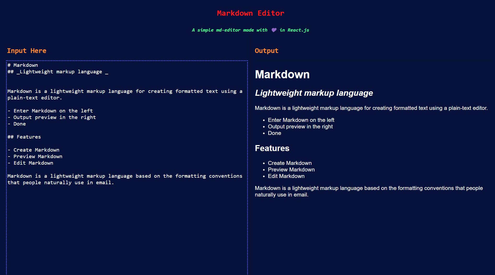

# Unicorn-Markdown-Editor
A simple md-editor made with 💜 in **React.js**

&nbsp;

# Usage
- Visit the github page [Markdown editor](https://dream-catcher45.github.io/Unicorn-Markdown-Editor/)
- Enter md text in the left side
- Preview Markdown in Right side
&nbsp;
# Screenshots
 

&nbsp;
# Support
**Github :** [Profile](https://github.com/dream-catcher45)
